# 🏛️ Municipal Services Tracking System

**A PyQt5 desktop app connecting citizens and municipal staff: utility subscriptions, billing, service requests, complaints and suggestions, stored in SQLite.**

<p>
  
  
  
</p>

👥 Team: Saed O S Radi, Abdulrahman Zeineddin, Kinan Al-Imam — university course project (FSMVU)

> **Educational project.** This is a fictional municipal system built for a university course. It isn't a clone of any real government or municipal service, and it isn't affiliated with any government body. All names, addresses and payment details in the screenshots are fake test data.

---

## Overview

The app has two sides, both desktop windows built with PyQt5 on top of a local SQLite database (`data.db`, created on first run):

- **Citizens** sign up, subscribe to municipal utilities, top up a transport card with a payment card, pay their bills, and send service requests, complaints and suggestions.
- **Municipal employees** log in to issue bills for each utility, manage citizen accounts, and review citizens' requests, complaints and suggestions.

<p align="center">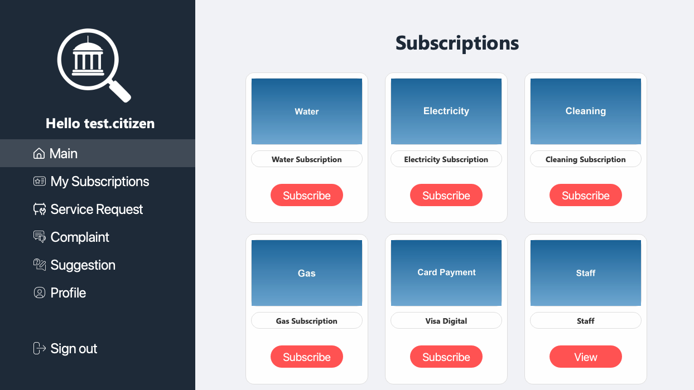</p>

## Features

### Citizens
- **Sign up / log in** with username, name, surname and password.
- **Utility subscriptions:** separate forms for **water**, **electricity**, **gas** and **cleaning**, each with its own fields (property type, usage, residents and water tank, phase and generator, stove type and cylinder size, cleaning frequency).
- **Visa Digital:** top up a transport card, paying with a credit/debit card.
- **My Subscriptions:** a list of all the citizen's subscriptions, plus **Pay Bills** for unpaid bills (requires a registered card).
- **Service request:** service type, description, address and an optional image.
- **Complaints** and **suggestions** forms.
- **Profile:** contact details, city, sex and birthday.

### Municipal employees
- **Employee login** (separate from citizen accounts).
- **Add Bill** for each utility: water, electricity and gas bills take consumption plus tiered rates; cleaning bills take a fixed amount.
- **All Users:** edit a citizen's name and surname, reset their password, or delete the account.
- **Users Activities:** every citizen's service requests, complaints and suggestions in one table, with a status (e.g. Pending) the employee can update.

## Screenshots

*Captured from the running app (off-screen) with fake test data.*

| Welcome | Sign up |
|:---:|:---:|
| 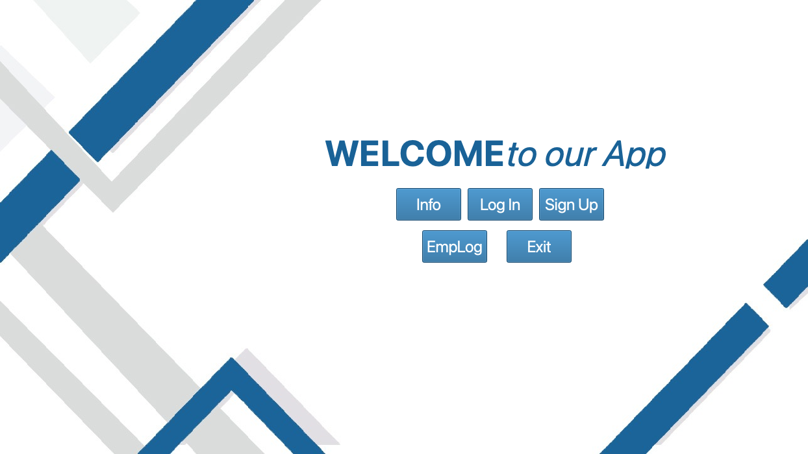 | 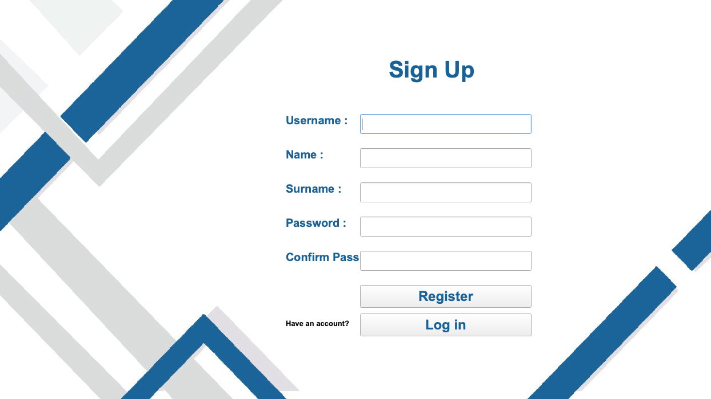 |

| My subscriptions | Water subscription form |
|:---:|:---:|
| 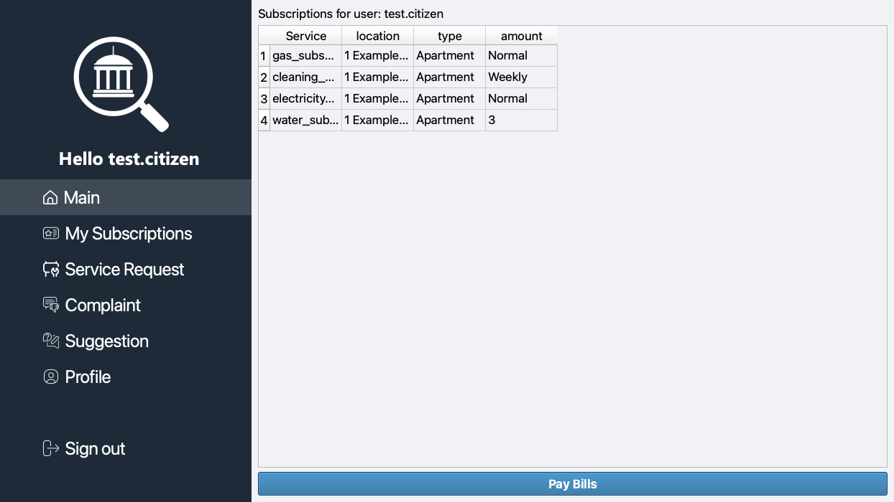 | 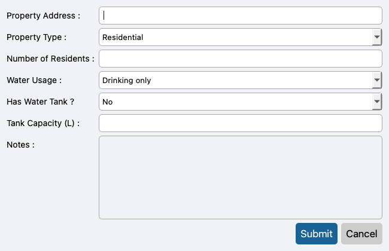 |

| Card payment (test card) | Service request |
|:---:|:---:|
| 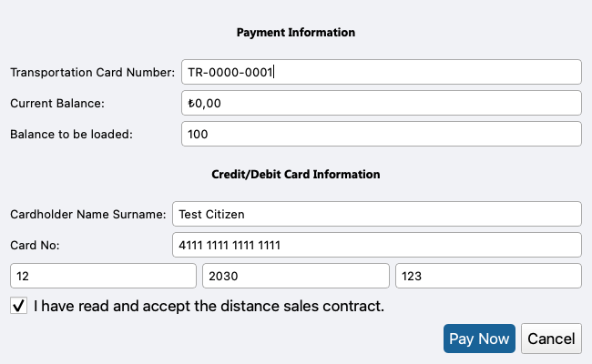 | 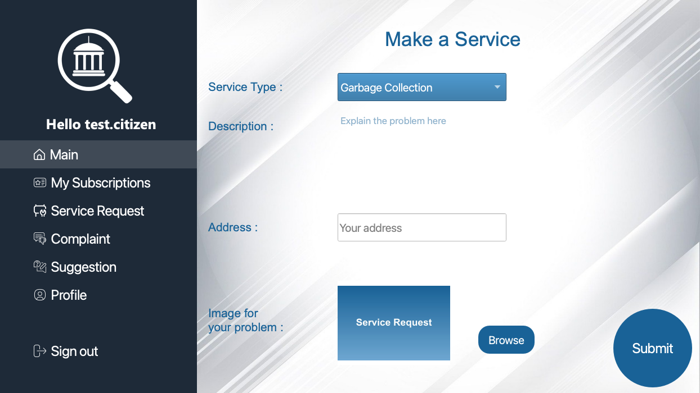 |

| Complaint | Employee dashboard |
|:---:|:---:|
| 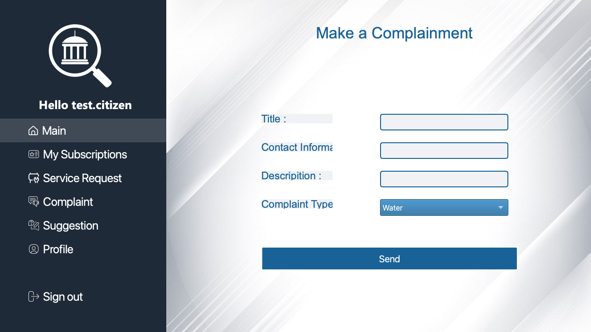 | 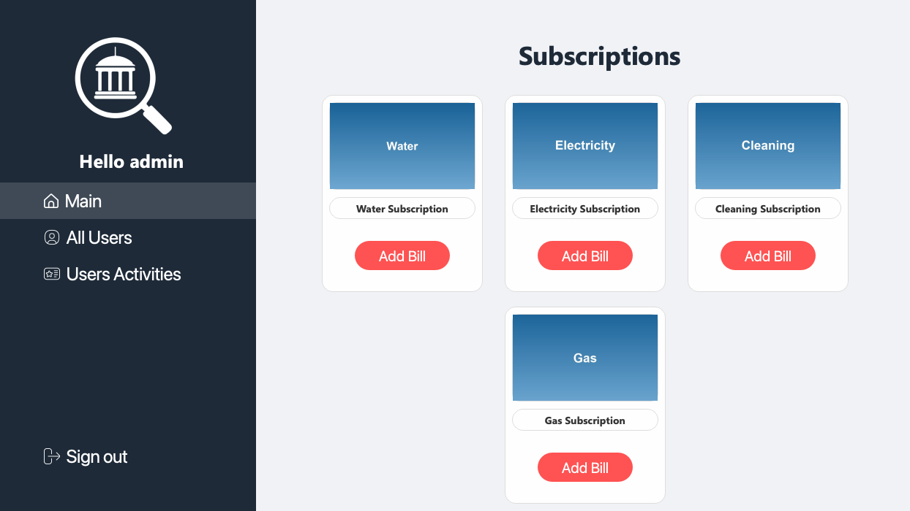 |

| All users (passwords never shown) | Users activities |
|:---:|:---:|
| 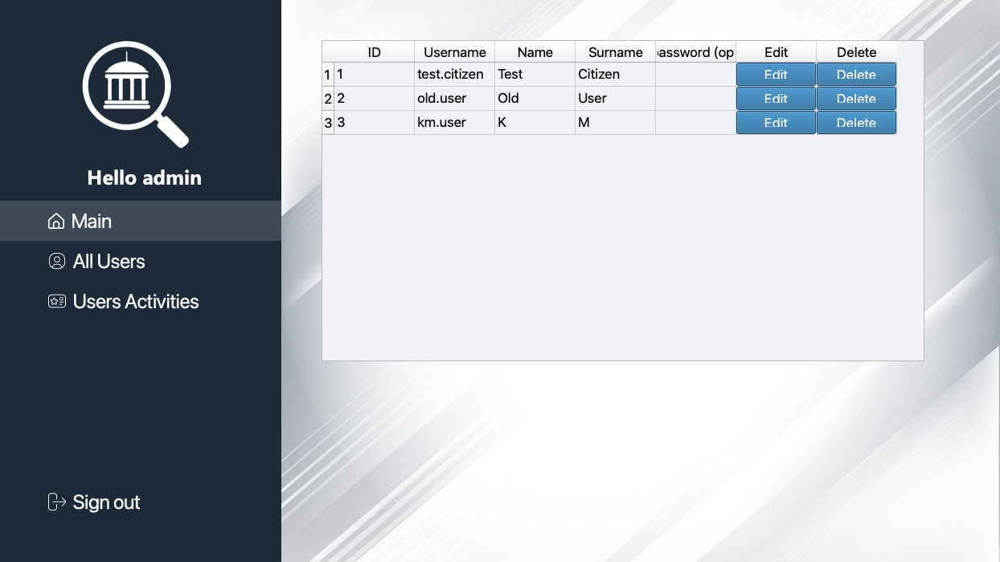 | 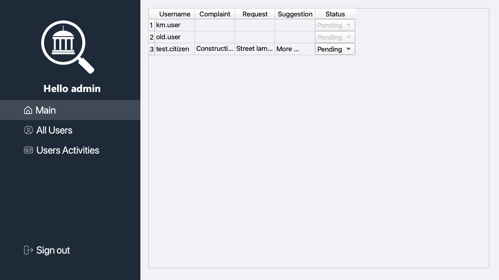 |

| Add water bill |
|:---:|
| 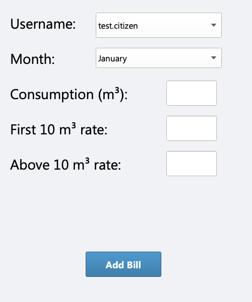 |

The card form shows Visa's public test number `4111 1111 1111 1111`; the database keeps only `**** **** **** 1111`.

## Tech Stack

| Area | Tools |
|---|---|
| Language | Python 3 |
| GUI | PyQt5 (Qt Widgets) |
| Database | SQLite (`sqlite3` standard library) |
| Charts | matplotlib (standalone report mock-up, see Known Limitations) |
| Security | PBKDF2-SHA256 password hashing (`hashlib`, standard library) |

## Project Structure

```
.
├── db_manager.py          # SQLite schema and all database access
├── security.py            # PBKDF2 password hashing / verification
├── user/                  # Citizen side: welcome (entry point), sign up, login, dashboard, forms, profile
├── employee/              # Employee side: login, dashboard, user management, users activities
├── bills_admin/           # Bill entry panels for water, electricity, gas and cleaning
├── images/                # Icons, backgrounds and placeholder card images
├── docs/report.pdf        # Original course report (student numbers redacted)
├── screenshots/
└── requirements.txt
```

## How to Run

```bash
python -m venv .venv
source .venv/bin/activate          # Windows: .venv\Scripts\activate
pip install -r requirements.txt
cd user
PYTHONPATH=.. python welcome.py     # Windows (cmd): set PYTHONPATH=.. && python welcome.py
```

Start it from the `user/` folder: the modules import each other both as packages from the project root (`PYTHONPATH=..`) and as siblings, and images are loaded from `../images/`. The database `data.db` is created in the project root on first run, together with the default employee account (see Known Limitations).

## Improvements

Changes made for this public version (the original course code is otherwise unchanged):

- **No CVV storage.** The CVV is validated (3–4 digits) and then discarded; it's never written to the database, and new databases have no CVV column.
- **Masked card numbers.** The payment card number is validated (13–19 digits, Luhn checksum), and only `**** **** **** 1234` is stored. Databases from older versions are cleaned automatically on startup: stored card numbers are masked and CVVs cleared, with SQLite `secure_delete` on so the old values are overwritten rather than left in free pages.
- **Hashed passwords.** Citizen and employee passwords are stored as **PBKDF2-HMAC-SHA256** hashes (600,000 iterations, random salt; `security.py`, standard library only) and checked in constant time. Plain-text passwords from older databases still work once and are upgraded to a hash on that login.
- **Passwords no longer shown to employees.** The All Users table used to display every password; it now has a blank *New password (optional)* column, where a new password is hashed and a blank one keeps the current password.
- **No SQL built from strings.** All queries use `?` placeholders. The one query assembled from table and column names (`fetch_user_subscriptions`) was replaced with fixed literal queries.
- **Portability fixes.** Image paths now consistently use `../images/` (six used a root-relative path that broke depending on the start folder), and a leftover debug `print` was removed.
- **Licensed images only.** Seven photos of uncertain origin (including a watermarked stock preview and a copyrighted news photo) were replaced with neutral, locally generated placeholders of the same size. The two dashboard screenshots in the report were updated to match.

## Known Limitations

- **Hard-coded default employee account.** On every start the app makes sure an employee account `admin` / `admin` exists (stored hashed). There's no screen to change employee passwords or create employees, so this default login can't be retired from inside the app.
- **Profile page.** The *Old / New / Confirm password* fields on the citizen profile page aren't connected to anything, and saved profile details aren't loaded back into the form.
- **Standalone mock-up screens.** `employee/Complainment_Requests.py` (a complaints list) and `employee/reborts.py` (a chart report) show fixed sample data instead of reading the database, and no menu opens them. `employee/all_Requests.py` and `employee/kinan_manager.py` are unused leftovers; `all_Requests.py` imports a module that's no longer in the project.
- **Simulated payments.** "Pay Now" and "Pay Bills" only record the payment in the database; no payment provider is involved.
- **Local, single-user database.** Data lives in one SQLite file next to the code.
